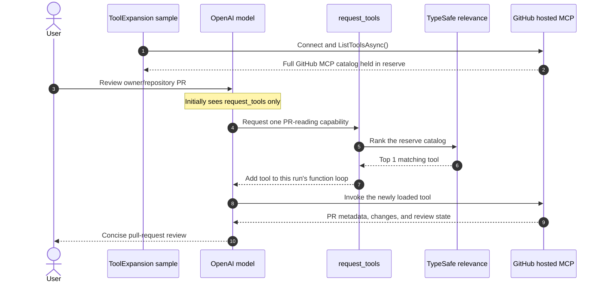
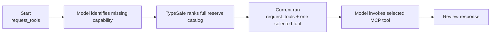

# TypeSafe AI: GitHub MCP Runtime Tool Expansion

> **Goal:** Start with _no_ GitHub capability except `request_tools`, then load exactly one relevant MCP tool while the model is already reasoning.

This sample reviews a GitHub pull request through GitHub's hosted MCP server. Unlike proactive selection, the agent does not receive a PR-reading tool at the start. It first asks the TypeSafe `request_tools` meta-tool for the capability it needs; TypeSafe ranks the full background catalog and injects one matching tool into the active function-calling loop.

## ✨ What this sample demonstrates

- **🫥 Minimal initial prompt** — the model starts with only `request_tools`; GitHub tool schemas are held in reserve.
- **🧠 Runtime relevance** — TypeSafe ranks the complete GitHub MCP catalog from the capability description supplied in the tool call.
- **🎯 One dynamic addition** — `TopK = 1` injects only the highest-ranked tool for this run.
- **🔄 Same-turn continuation** — `UseTypeSafeToolExpansion()` preserves the function loop, so the model calls the newly loaded tool without restarting the request.
- **🧪 Offline demo** — a credential-free five-tool catalog proves that PR-read is loaded and invoked while write tools remain unused.

## 🗺️ End-to-end flow



### Tool visibility over time



The catalog is never appended to the caller's original `ChatOptions`. `UseTypeSafeToolExpansion()` clones options for each run, and the discovered tool is merged only into that private per-run list.

## 🧩 How the pieces fit

| Component | Responsibility |
| --- | --- |
| `McpClient` | Retrieves the live GitHub MCP tools and keeps their MCP connection available for invocation. |
| `CreateDynamicToolExpansionTool` | Creates `request_tools`, the only tool initially registered with the agent. |
| `TypeSafe` | Scores the background catalog from the model's requested capability and returns one tool. |
| `UseTypeSafeToolExpansion` | Owns the function loop and safely adds the discovered tool to the active run. |
| `ChatClientAgent` | Tells the model to request a PR-read capability and produce a read-only review. |

The expansion configuration sets `TopK = 1`, includes structured parameter metadata in ranking, has no minimum relevance threshold, and fails closed if relevance evaluation fails.

## ▶️ Run the offline demo

The default run does not contact GitHub, OpenAI, or TypeSafe. It uses an in-process catalog with PR-read, issue-read, repository-search, PR-create, and PR-merge candidates.

```powershell
dotnet run --project samples/TypeSafe.Sample.ToolExpansion
```

Or state the mode explicitly:

```powershell
dotnet run --project samples/TypeSafe.Sample.ToolExpansion -- --offline
```

Expected output includes:

```text
Catalog tools eligible for selection: 5
Offline review: PR #123 is open. ...
```

## 🌐 Run a live GitHub MCP review

### 1. Set credentials

```powershell
$env:TYPESAFE_API_KEY="..."
$env:OPENAI_API_KEY="..."
$env:OPENAI_MODEL="gpt-5.4-mini"
$env:GITHUB_PAT_TOKEN="github_pat_..."

# Optional for OpenAI-compatible services:
# $env:OPENAI_BASE_URL="https://your-openai-compatible-endpoint/v1"
```

### 2. Target a pull request

```powershell
dotnet run --project samples/TypeSafe.Sample.ToolExpansion -- `
  --live --repo owner/repository --pr 123
```

`--repo` must be `owner/repository`; `--pr` must be a positive integer. The sample reaches `https://api.githubcopilot.com/mcp/x/all` via Streamable HTTP and sends `GITHUB_PAT_TOKEN` as a bearer token only to that HTTPS origin. Cookies and redirects are disabled.

> **⚠️ Write tools:** The complete hosted catalog participates in relevance ranking by design. The model begins with only `request_tools`, and this review prompt requests a read-only capability, but this does not create a server-enforced read-only boundary. Use a least-privilege PAT and a GitHub MCP read-only catalog/toolset for production workflows that must not mutate GitHub.

## 🆚 Proactive Selection vs Reactive Expansion

| Pattern | When TypeSafe chooses | What the model initially sees | Best fit |
| --- | --- | --- | --- |
| **Proactive selection** | Before the first model turn | One shortlisted tool | The user request makes the needed capability obvious. |
| **Reactive expansion** | During the function loop | `request_tools` only | The required capability emerges while the model reasons through multiple steps. |

Read the companion [Tool Selection README](../TypeSafe.Sample.ToolSelection/README.md) for the proactive-selection version of this GitHub MCP scenario.
