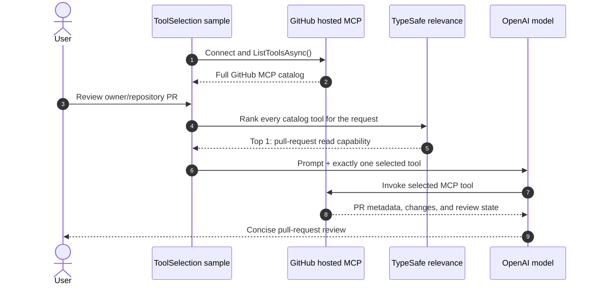
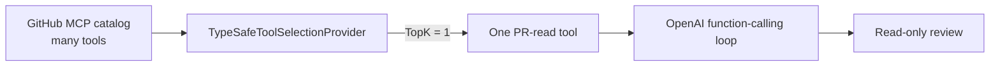

# TypeSafe AI: GitHub MCP Proactive Tool Selection

> **Goal:** Give the model one useful GitHub tool _before_ its first reasoning turn, even though GitHub MCP exposes a much larger catalog.

This sample reviews a GitHub pull request. It discovers GitHub's hosted MCP tools, asks TypeSafe which tool best fits the PR-review request, and gives the OpenAI model only that shortlisted tool. The model never has to sift through every issue, repository, workflow, search, and write-capable tool in the catalog.

## ✨ What this sample demonstrates

- **🔎 Catalog discovery** — the live sample calls GitHub MCP `ListToolsAsync()` and uses the returned tool schemas as the candidate catalog.
- **🧠 Pre-turn relevance** — `TypeSafeToolSelectionProvider` evaluates the user request before the first model call.
- **🎯 One-tool shortlist** — `TopK = 1` leaves the model with one best-fit tool, including its parameter schema.
- **🔁 Normal function loop** — the model calls the selected tool, receives the MCP result, then writes the review.
- **🧪 Offline demo** — a five-tool GitHub-like catalog runs without credentials or network access and proves that only `pull_request_read` executes.

## 🗺️ End-to-end flow



### Before and after selection



The important timing is that TypeSafe runs **before** the model sees its tools. This removes irrelevant JSON schemas from the initial model request and makes the available capability unambiguous.

## 🧩 How the pieces fit

| Component | Responsibility |
| --- | --- |
| `McpClient` | Connects to the hosted GitHub MCP server and materializes its tools as `AITool` instances. |
| `TypeSafeToolSelectionProvider` | Scores each candidate tool against the PR-review request and replaces the agent's tool list with the shortlist. |
| `FunctionInvokingChatClient` | Runs the normal model → function → model loop once the selected tool is available. |
| `ChatClientAgent` | Supplies review instructions and the full candidate catalog to the selection provider. |

`MinimumRelevanceProbability = null` retains the highest-ranked tool, while `FallbackMode = Throw` fails closed if relevance evaluation cannot complete. The original MCP catalog is not modified; the shortlist exists only for the run.

## ▶️ Run the offline demo

The default execution has no external dependencies. Its catalog contains competing read tools plus `pull_request_create` and `pull_request_merge`, so the output makes the selection behavior visible.

```powershell
dotnet run --project samples/TypeSafe.Sample.ToolSelection
```

Or state the mode explicitly:

```powershell
dotnet run --project samples/TypeSafe.Sample.ToolSelection -- --offline
```

Expected output includes:

```text
Catalog tools eligible for proactive selection: 5
Offline review: PR #123 is open. ...
```

## 🌐 Run a live GitHub MCP review

### 1. Set credentials

```powershell
$env:TYPESAFE_API_KEY="..."
$env:OPENAI_API_KEY="..."
$env:OPENAI_MODEL="gpt-5.4-mini"
$env:GITHUB_PAT_TOKEN="github_pat_..."

# Optional for OpenAI-compatible services:
# $env:OPENAI_BASE_URL="https://your-openai-compatible-endpoint/v1"
```

### 2. Target a pull request

```powershell
dotnet run --project samples/TypeSafe.Sample.ToolSelection -- `
  --live --repo owner/repository --pr 123
```

`--repo` must be `owner/repository`; `--pr` must be a positive integer. The sample connects to `https://api.githubcopilot.com/mcp/x/all` over Streamable HTTP and attaches `GITHUB_PAT_TOKEN` as a bearer token only for HTTPS requests. Cookies and redirects are disabled.

> **⚠️ Write tools:** The full hosted catalog is deliberately eligible for ranking in this example. The prompt asks for a read-only review and the sample exposes only one selected tool, but this is not a substitute for a server-side permission boundary. For production read-only workflows, use a least-privilege token and a GitHub MCP read-only catalog/toolset.

## 🆚 Proactive Selection vs Reactive Expansion

| Pattern | When TypeSafe chooses | What the model initially sees | Best fit |
| --- | --- | --- | --- |
| **Proactive selection** | Before the first model turn | The already-shortlisted tool | The user request clearly identifies the needed capability. |
| **Reactive expansion** | After the model calls `request_tools` | Only the `request_tools` meta-tool | The needed capability becomes clear during multi-step reasoning. |

Read the companion [Tool Expansion README](../TypeSafe.Sample.ToolExpansion/README.md) for the runtime-expansion version of this GitHub MCP scenario.
